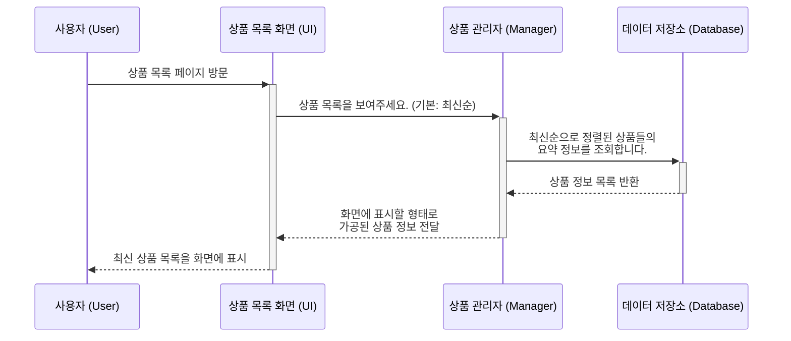
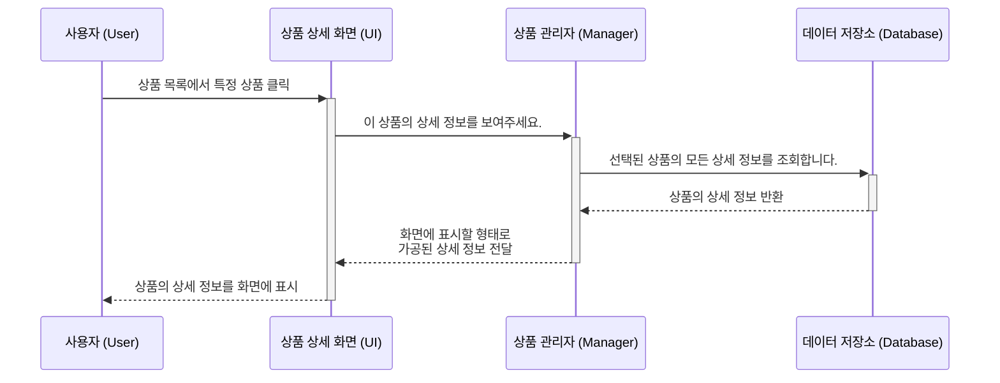
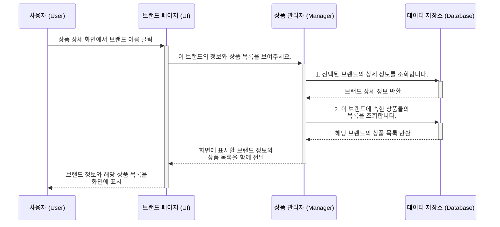
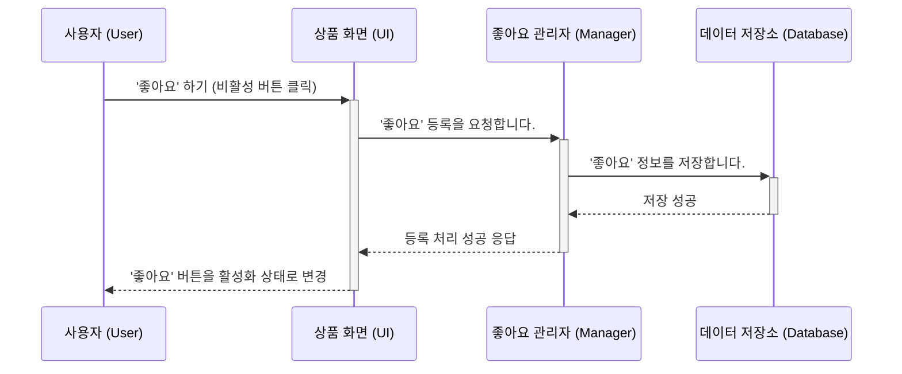
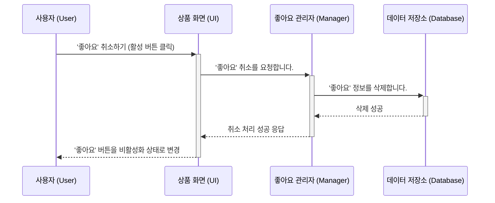
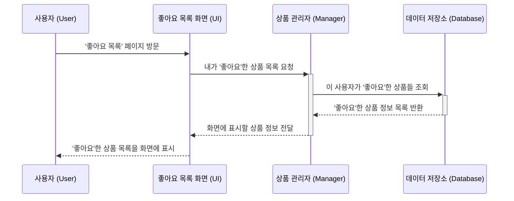
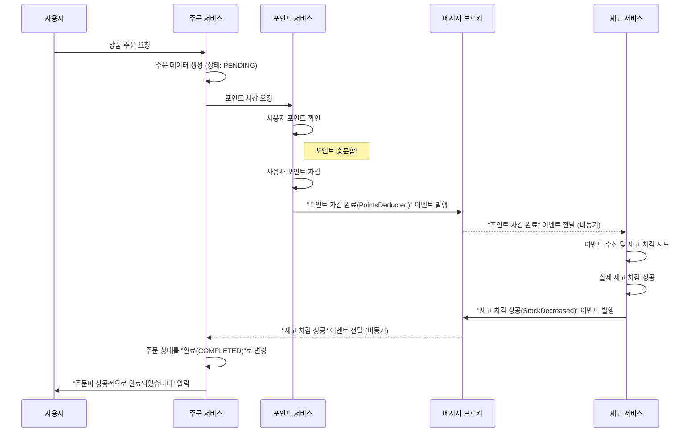
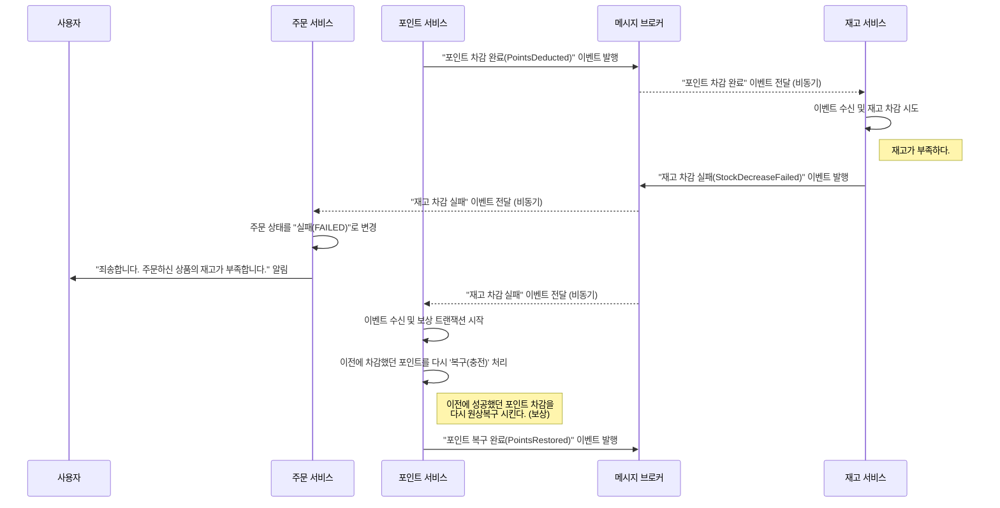
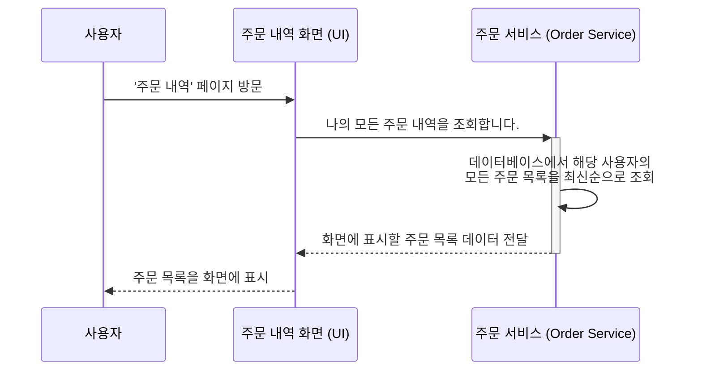
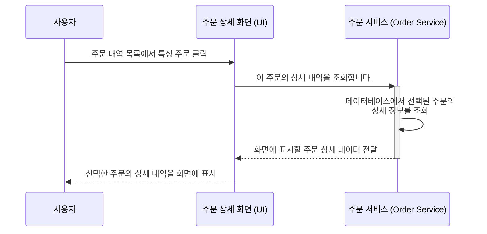

# 시퀀스 다이어그램

## 상품 

### 상품 목록 

### 상품 상세

## 브랜드

### 브랜드 정보 조회 

## 좋아요 

### 좋아요 등록
 

### 좋아요 취소 

### 좋아요 목록

## 주문 

### 주문 생성

시나리오 1 : 주문 성공 

시나리오 2 : 재고 부족으로 인한 보상

포인트 차감 완료 이벤트 발행까지는 이전과 동일

### 주문 목록

### 주문 상세

