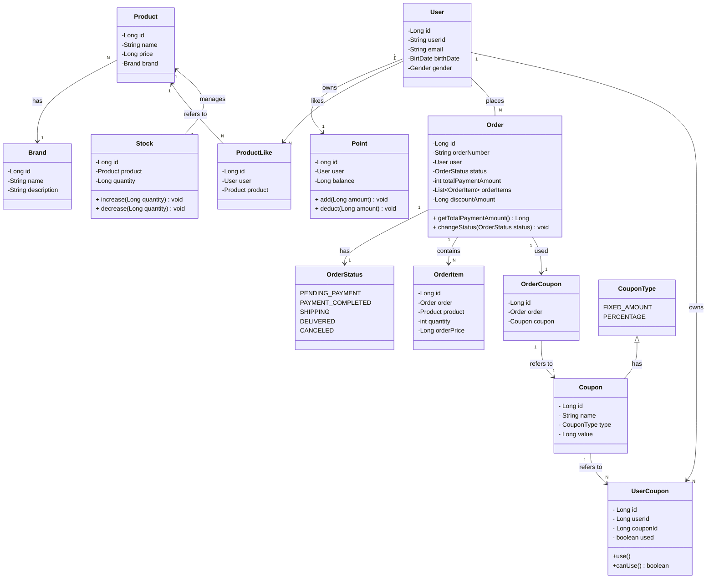

# 클래스 다이어그램

```mermaid
classDiagram
    class User {
        -Long id
        -String userId
        -String email
        -BirtDate birthDate
        -Gender gender
    }
    
    class Point  {
        -Long id
        -User user
        -Long balance
        
        + add(Long amount) void
        + deduct(Long amount) void
    }


    class Product {
        -Long id
        -String name
        -Long price
        -Brand brand
    }
    
    class Stock {
        -Long id
        -Product product
        -Long quantity
        
        + increase(Long quantity) void
        + decrease(Long quantity) void
    }

    class Brand {
        -Long id
        -String name
        -String description
    }

    class ProductLike {
        -Long id
        -User user
        -Product product
    }

    class Order {
        -Long id
        -String orderNumber
        -User user
        -OrderStatus status
        -int totalPaymentAmount
        -List~OrderItem~ orderItems
        -Long discountAmount    
        
        + getTotalPaymentAmount() Long
        + changeStatus(OrderStatus status) void

    }

    class OrderItem {
        -Long id
        -Order order
        -Product product
        -int quantity
        -Long orderPrice
    }
    
    class OrderCoupon {
        -Long id
        -Order order
        -Coupon coupon
    }


        
    
      class OrderStatus {
          
        PENDING_PAYMENT
        PAYMENT_COMPLETED
        SHIPPING
        DELIVERED
        CANCELED
    }

    class Coupon {
        - Long id
        - String name
        - CouponType type
        - Long value
    }

    
    class CouponType {
        
        FIXED_AMOUNT
        PERCENTAGE
    }
    
   
    
    class UserCoupon {
        - Long id
        - Long userId
        - Long couponId
        - boolean used
        
        +use()
        +canUse() boolean
 }
 
    
    Product "N" --> "1" Brand : has
    Product "1" <-- "N" ProductLike : refers to
    Product "1" <-- "1" Stock : manages
    User "1" --> "1" Point : owns
    Order "1"-->"1" OrderStatus : has
    User "1"-->"N" ProductLike : likes
    User "1" -- "N" Order : places
    Order "1" --> "N" OrderItem : contains
    Coupon "1" --> "N" UserCoupon : refers to
    User "1" --> "N" UserCoupon : owns
    Order "1" --> "1" OrderCoupon : used
    OrderCoupon "1" --> "1" Coupon : refers to
    CouponType <|-- Coupon : has


```

