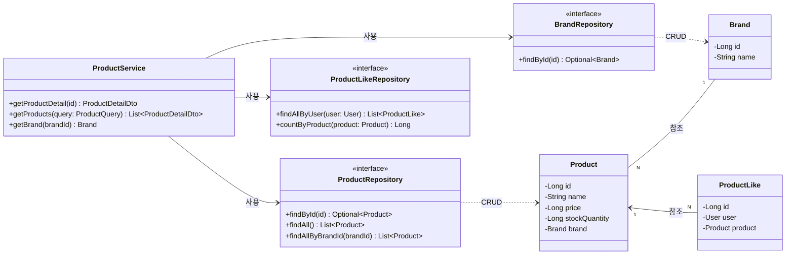
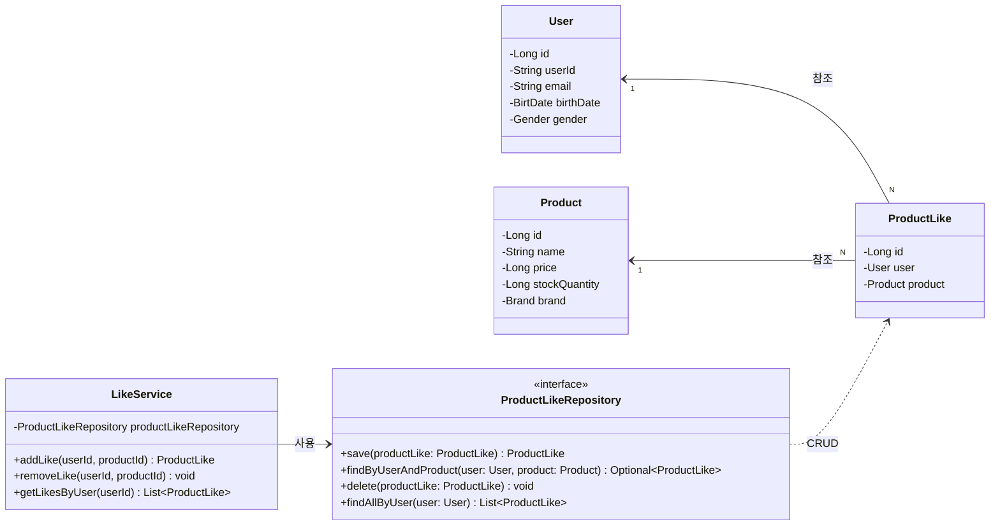
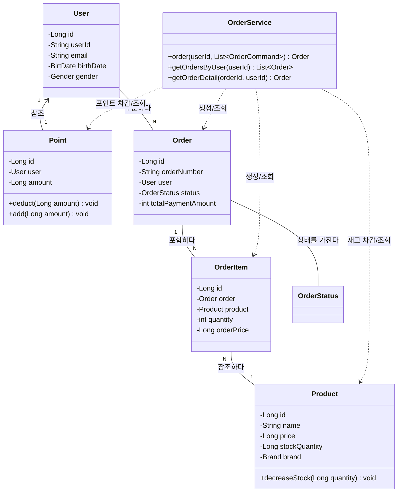

# 클래스 다이어그램

## 상품 & 브랜드

```mermaid
classDiagram
    direction LR

    class Product {
        -Long id
        -String name
        -Long price
        -Long stockQuantity
        -Brand brand
    }

    class Brand {
        -Long id
        -String name
    }

    class ProductLike {
        -Long id
        -User user
        -Product product
    }

    class ProductRepository {
        <<interface>>
        +findById(id) Optional~Product~
        +findAll() List~Product~
        +findAllByBrandId(brandId) List~Product~
    }

    class ProductLikeRepository {
        <<interface>>
        +findAllByUser(user: User) List~ProductLike~
        +countByProduct(product: Product) Long
    }

    class BrandRepository {
        <<interface>>
        +findById(id) Optional~Brand~
    }

    class ProductService {
        +getProductDetail(id) ProductDetailDto
        +getProducts(query: ProductQuery) List~ProductDetailDto~
        +getBrand(brandId) Brand
    }

    Product "N" -- "1" Brand: 참조
    Product "1" <-- "N" ProductLike: 참조
    ProductService --> ProductRepository: 사용
    ProductService --> BrandRepository: 사용
    ProductService --> ProductLikeRepository: 사용
    ProductRepository ..> Product: CRUD
    BrandRepository ..> Brand: CRUD
```

## 좋아요 

```mermaid
classDiagram
    direction LR

    class User {
        -Long id
        -String userId
        -String email
        -BirtDate birthDate
        -Gender gender
    }

    class Product {
        -Long id
        -String name
        -Long price
        -Long stockQuantity
        -Brand brand
    }

    class ProductLike {
        -Long id
        -User user
        -Product product
    }

    class ProductLikeRepository {
        <<interface>>
        +save(productLike: ProductLike) ProductLike
        +findByUserAndProduct(user: User, product: Product) Optional~ProductLike~
        +delete(productLike: ProductLike) void
        +findAllByUser(user: User) List~ProductLike~
    }

    class LikeService {
        -ProductLikeRepository productLikeRepository
        +addLike(userId, productId) ProductLike
        +removeLike(userId, productId) void
        +getLikesByUser(userId) List~ProductLike~
    }

    User "1"<--"N" ProductLike : 참조
    Product "1"<--"N" ProductLike : 참조
    LikeService --> ProductLikeRepository : 사용
    ProductLikeRepository ..> ProductLike : CRUD
```

## 주문

```mermaid
classDiagram
    direction TB

    class User {
        -Long id
        -String userId
        -String email
        -BirtDate birthDate
        -Gender gender
        
    }
    
    class Point {
        -Long id
        -User user
        -Long amount 
        +deduct(Long amount) void
        +add(Long amount) void 
    }

    class Product {
        -Long id
        -String name
        -Long price
        -Long stockQuantity
        -Brand brand
        +decreaseStock(Long quantity) void
    }

    class Order {
        -Long id
        -String orderNumber
        -User user
        -OrderStatus status 
        -int totalPaymentAmount 
        
    }

    class OrderItem {
        -Long id
        -Order order
        -Product product
        -int quantity 
        -Long orderPrice 
    }

    class OrderService {
        +order(userId, List~OrderCommand~) Order
        +getOrdersByUser(userId) List~Order~ 
        +getOrderDetail(orderId, userId) Order 
    }

    enum OrderStatus 
        PENDING_PAYMENT
        PAYMENT_COMPLETED
        SHIPPING
        DELIVERED
        CANCELED

    User "1"<--"1" Point : 참조
    User "1" -- "N" Order : 주문하다
    Order "1" -- "N" OrderItem : 포함하다
    OrderItem "N" -- "1" Product : 참조하다
    OrderService ..> Order : 생성/조회
    OrderService ..> OrderItem : 생성/조회
    OrderService ..> Point : 포인트 차감/조회
    OrderService ..> Product : 재고 차감/조회
    Order -- OrderStatus : 상태를 가진다
```
