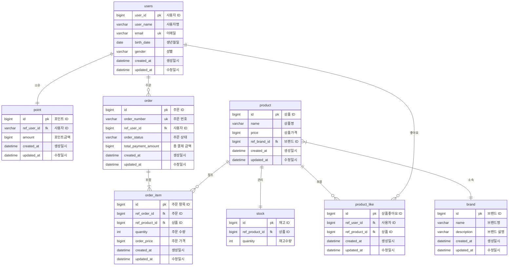

# ERD

```mermaid
erDiagram
    users {
    bigint user_id pk "사용자 ID"
    varchar user_name "사용자명"
    varchar email uk "이메일"
    date birth_date "생년월일"
    varchar gender "성별"
    datetime created_at "생성일시"
    datetime updated_at "수정일시"
    }
    
    
    point {
    bigint id pk "포인트 ID"
    varchar ref_user_id fk "사용자 ID"
    bigint amount "포인트금액"
    datetime created_at "생성일시"
    datetime updated_at "수정일시"
    }

  

 
    product {
    bigint id pk "상품 ID"
    varchar name "상품명"
    bigint price "상품가격"
    bigint ref_brand_id fk "브랜드 ID"
    datetime created_at "생성일시"
    datetime updated_at "수정일시"
    }
    
    stock {
    bigint id pk "재고 ID"
    bigint ref_product_id fk "상품 ID"
    int quantity "재고수량"
    }
    
    brand {
    bigint id pk "브랜드 ID"
    varchar name  "브랜드명"
    varchar description "브랜드 설명"
    datetime created_at "생성일시"
    datetime updated_at "수정일시"
    }
    
    product_like {
    bigint id pk "상품좋아요 ID"
    bigint ref_user_id fk "사용자 ID"
    bigint ref_product_id fk "상품 ID"
    datetime created_at "생성일시"
    datetime updated_at "수정일시"
    }
    
    order {
    bigint id pk "주문 ID"
    varchar order_number uk "주문 번호"
    bigint ref_user_id fk "사용자 ID"
    varchar order_status "주문 상태"
    bigint total_payment_amount "총 결제 금액"
    datetime created_at "생성일시"
    datetime updated_at "수정일시"
    }
    
    order_item {
    bigint id pk "주문 항목 ID"
    bigint ref_order_id fk "주문 ID"
    bigint ref_product_id fk "상품 ID"
    int quantity "주문 수량"
    bigint order_price "주문 가격"
    datetime created_at "생성일시"
    datetime updated_at "수정일시"

}

users ||--o{ order: "주문"
users ||--o{ product_like: "좋아요"
users ||--|| point: "소유"

product ||--o{ order_item: "참조"
product ||--o{ product_like : "포함"
product ||--|| stock : "관리"
product }|--|| brand: "소속"

order ||--|{ order_item: "포함"
```
