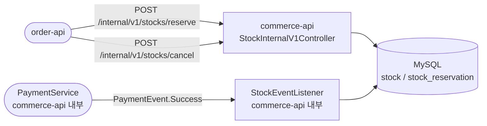
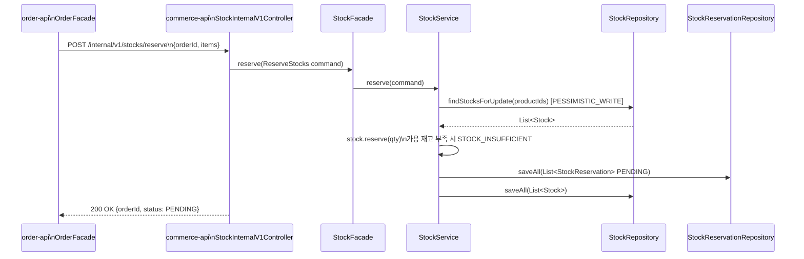
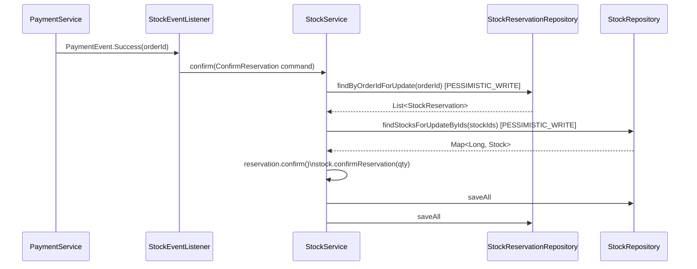
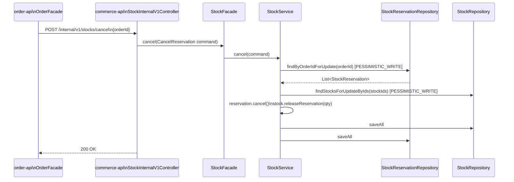
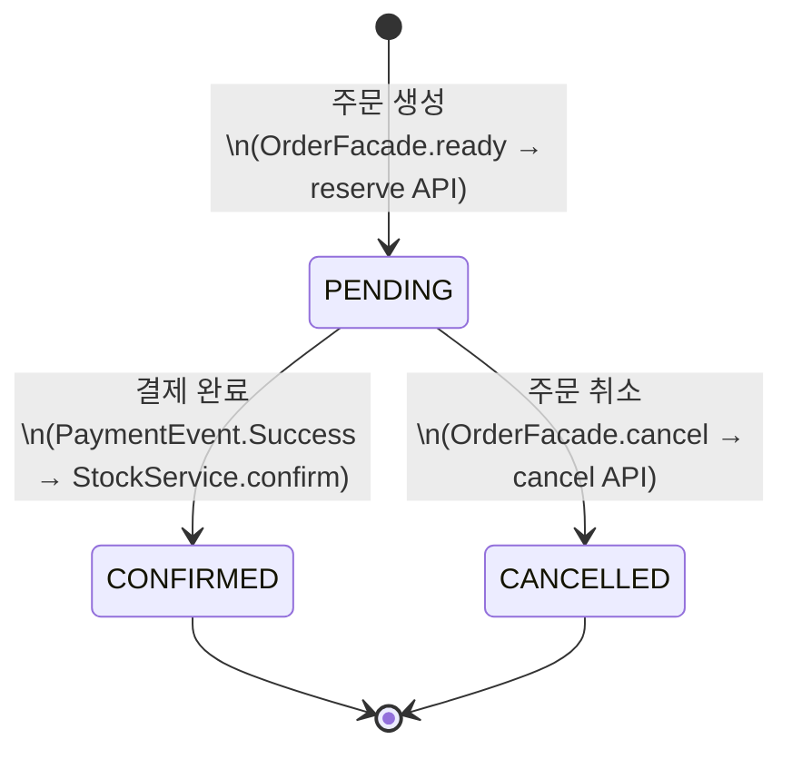

# HLD: 재고 선점(Stock Reservation)

## Glossary

| 용어 | 정의 |
|------|------|
| 재고 선점(Stock Reservation) | 주문 생성 시점에 가용 재고를 미리 확보하여 타 주문이 동일 재고를 사용하지 못하도록 잠그는 행위 |
| 가용 재고(Available Stock) | 실물 재고(quantity)에서 선점 수량(reserved_quantity)을 뺀 값. 고객이 실제로 구매 가능한 수량 |
| 실물 재고(L1) | `stock.quantity` — 창고에 실재하는 재고 수치 |
| 선점 수량(Reserved) | `stock.reserved_quantity` — 주문 생성 후 결제 완료 전까지 잠긴 수량 |
| 오버셀(Oversell) | 실재 재고보다 많은 주문이 결제 완료되어 상품을 출고할 수 없게 되는 상황 |
| PENDING | `StockReservation.status` — 재고가 선점되었으나 결제가 아직 완료되지 않은 상태 |
| CONFIRMED | `StockReservation.status` — 결제 완료로 선점이 확정된 상태. L1 실물 재고가 차감됨 |
| CANCELLED | `StockReservation.status` — 주문 취소로 선점이 해제된 상태. 가용 재고가 복원됨 |
| Internal API | order-api ↔ commerce-api 간 서비스 내부 통신용 HTTP API. 외부 공개 금지 |
| PaymentEvent.Success | 결제 완료 시 commerce-api 내부에서 발행되는 도메인 이벤트 |

---

## Overview

주문 생성 시점에 재고를 선점하여, 결제 완료 전 오버셀을 원천 차단한다. 현재 시스템은 결제 완료(`PaymentEvent.Success`) 이후에만 재고를 차감하므로, 동시 주문 시 복수의 결제가 성공한 뒤 재고가 부족해지는 문제가 발생한다.

이 설계는 PRD의 목표(주문 생성 시 재고 선점, 오버셀 0건, 결제 완료 시 예약 확정, 주문 취소 시 재고 복원)를 달성하기 위한 commerce-api와 order-api 간 협업 구조를 정의한다.

**범위 (Scope)**
- 포함: 재고 선점(reserve) API, 선점 취소(cancel) API, 결제 완료 이벤트 기반 선점 확정(confirm), `StockReservation` 이력 엔티티, `stock` 테이블 `reserved_quantity` 컬럼 추가
- 제외: SKU 단위 재고 관리(SLS 범위), 입고(Inbound) API(SLS 범위), 재고 조회 Public API, Dead Letter Queue 기반 confirm 실패 보상 처리

---

## System Context



| 외부 시스템 | 방향 | 데이터 |
|------------|------|--------|
| order-api | → 입력 | `orderId`, 주문 상품별 `productId` + `quantity` |
| order-api | ← 출력 | 선점 결과 (`orderId`, `status: PENDING`) |
| PaymentEvent.Success (내부 이벤트) | → 입력 | `orderId` |
| MySQL | ← 출력 | stock, stock_reservation 레코드 |

---

## High-Level Architecture

프로젝트는 `interfaces/api → application → domain ← infrastructure` 레이어드 아키텍처를 따른다.

**컴포넌트 구조**

```text
commerce-api
└── com.loopers.
    ├── domain/stock/
    │   ├── Stock.java                       (기존 수정)
    │   ├── StockReservation.java            (신규)
    │   ├── StockService.java                (기존 수정 — reserve/confirm/cancel 추가)
    │   ├── StockRepository.java             (기존 수정 — findStocksForUpdateByIds 추가)
    │   ├── StockReservationRepository.java  (신규)
    │   ├── StockCommand.java                (기존 수정 — ReserveStocks/ConfirmReservation/CancelReservation 추가)
    │   └── StockEventListener.java          (기존 수정 — deduct → confirm 교체)
    ├── application/stock/
    │   └── StockFacade.java                 (신규 — reserve/cancel 위임)
    ├── interfaces/api/stock/
    │   ├── StockInternalV1Controller.java   (신규)
    │   ├── StockInternalV1ApiSpec.java      (신규)
    │   └── StockInternalV1Dto.java          (신규)
    └── infrastructure/stock/
        ├── StockJpaRepository.java          (기존 수정 — findStocksForUpdateByIds 추가)
        ├── StockCoreRepository.java         (기존 수정)
        ├── StockReservationJpaRepository.java  (신규)
        └── StockReservationCoreRepository.java (신규)

order-api
└── com.loopers.
    ├── application/order/
    │   └── OrderFacade.java                 (기존 수정 — reserve/cancel 호출 추가)
    └── infrastructure/feign/commerce/
        ├── CommerceApiClient.java           (기존 수정 — reserveStock/cancelStock 메서드 추가)
        └── CommerceApiDto.java              (기존 수정 — StockReserveRequest/Response/CancelRequest 추가)
```

**레이어별 역할**

| 레이어 | 클래스 | 책임 |
|--------|--------|------|
| interfaces/api | `StockInternalV1Controller` | reserve / cancel Internal API 진입점 |
| interfaces/api | `StockInternalV1ApiSpec` | Swagger 문서화 인터페이스 |
| interfaces/api | `StockInternalV1Dto` | 요청/응답 DTO (ReserveRequest, CancelRequest, ReserveResponse) |
| application | `StockFacade` | reserve / cancel 오케스트레이션. confirm은 내부 이벤트 경로이므로 포함하지 않음 |
| domain | `StockService` | reserve / confirm / cancel 비즈니스 로직 + 비관적 락 조율 |
| domain | `Stock` | L1(quantity) / Reserved(reserved_quantity) 수치 관리 |
| domain | `StockReservation` | 예약 이력 엔티티 (PENDING → CONFIRMED/CANCELLED 상태 전이) |
| domain | `StockEventListener` | `PaymentEvent.Success` 수신 → `StockService.confirm()` 호출 |
| infrastructure | `StockJpaRepository` | `findStocksForUpdate(productIds)`, `findStocksForUpdateByIds(ids)` JPA 쿼리 |
| infrastructure | `StockReservationJpaRepository` | `findByOrderIdForUpdate(orderId)` JPA 쿼리 |
| infrastructure | `CommerceApiClient` (order-api) | Feign 클라이언트 — `reserveStock`, `cancelStock` 메서드 |

> `StockEventListener`는 `StockService`를 직접 호출한다. confirm은 외부 API 요청이 아닌 내부 이벤트 기반이므로 `StockFacade`를 경유하지 않는다.

---

**주요 흐름 — US-02: 주문 생성 시 재고 선점 (AC-01, AC-02, AC-03)**



**주요 흐름 — US-03: 결제 완료 시 예약 확정 (AC-04)**



**주요 흐름 — US-04: 주문 취소 시 재고 복원 (AC-05)**



---

## Key Design Decisions

| 결정 항목 | 선택 | 대안 | 이유 |
|-----------|------|------|------|
| 동시성 전략 | 비관적 락 (`SELECT ... FOR UPDATE`) | 낙관적 락 (`@Version`), Redis 분산 락 | 기존 `findStocksForUpdate()` 패턴을 재사용하므로 코드 일관성 유지. 낙관적 락은 재시도 로직 추가 필요. Redis 락은 외부 의존성 증가. 재고 선점은 충돌 빈도가 높아 비관적 락이 적합 |
| confirm 처리 경로 | `PaymentEvent.Success` 이벤트 → `StockEventListener` → `StockService.confirm()` 직접 호출 | POST /internal/v1/stocks/confirm External API 추가 | confirm은 order-api가 아닌 commerce-api 내부 결제 이벤트에서 트리거되므로 Internal API 불필요. Facade 경유도 불필요. 기존 이벤트 기반 흐름 유지 |
| stock 엔드포인트 위치 | 기존 `CommerceApiClient`에 `reserveStock`, `cancelStock` 메서드 추가 | 별도 `StockApiClient` 클래스 신규 생성 | 프로젝트에 이미 `CommerceApiClient` 단일 Feign 클라이언트 패턴이 확립되어 있음. 클라이언트 분산 시 관리 복잡성 증가 |
| N+1 방지 (confirm/cancel) | stockId 목록 수집 후 `findStocksForUpdateByIds(ids)` 배치 조회 | 각 예약별 단건 `findById` 조회 | PENDING 예약이 다수일 때 단건 조회 시 N개의 SELECT 발생. 배치 조회로 쿼리 1회로 통합 |
| 재고 선점 호출 시점 | `OrderFacade.ready()` 내 신규 Order 생성 직후, `validatePay()` 호출 전 | Order 생성 전 선점, Order 저장과 동일 트랜잭션 | Order가 생성된 후에만 `orderId`가 확정되므로 선점 API에 전달 가능. 재시도(기존 Order 존재) 시 중복 선점 방지를 위해 신규 여부 판별 후 조건부 호출 |

---

## Non-Functional Requirements

| 항목 | 요구사항 |
|------|---------|
| 성능 | 재고 선점(reserve) API P99 응답시간 500ms 이내 (비관적 락 보유 시간 최소화를 위해 트랜잭션 범위를 재고 조회-수정-저장으로 한정). 배치 조회(`IN` 절) 사용으로 confirm/cancel 쿼리 수 O(1) 유지 |
| 동시성 정합성 | 동일 재고에 대한 동시 주문 N건 중 가용 재고 수를 초과하는 주문은 0건 성공 (AC-03: 재고 10개에 11명 동시 주문 시 정확히 10명만 성공) |
| 데이터 정합성 | `stock.quantity - stock.reserved_quantity >= 0` 항상 성립. `StockReservation.status`가 CONFIRMED인 레코드의 `quantity` 합산값은 `stock.quantity` 감소분과 일치해야 함 |
| 오버셀 | 결제 완료 후 재고 부족으로 인한 강제 환불 0건 (PRD 성공 지표) |
| 장애 격리 | reserve 호출 중 commerce-api 장애 시 Feign 예외가 `OrderFacade.ready()` 트랜잭션으로 전파되어 Order 미생성. confirm 실패(이벤트 리스너 예외)는 결제와 분리되어 수동 조정 대상으로 기록 (Dead Letter Queue 도입은 이번 범위 제외) |
| 보안 | `/internal/v1/**` 경로는 서비스 내부망에서만 접근 가능하도록 네트워크 레벨에서 제한. 인증 토큰 불필요 (Internal API 관례) |

---

## State Transition Model

`StockReservation.status`의 상태 전이를 정의한다.



**상태 정의**

| 상태 | 설명 |
|------|------|
| PENDING | 재고가 선점됨. `stock.reserved_quantity` 증가. 결제 미완료 |
| CONFIRMED | 결제 완료로 예약 확정. `stock.quantity` 감소, `stock.reserved_quantity` 감소 |
| CANCELLED | 주문 취소로 선점 해제. `stock.reserved_quantity` 감소 (가용 재고 복원) |

**허용되지 않는 전이**
- `CONFIRMED → PENDING`: 결제 완료 후 재선점 불가 — 재고 수치 이중 차감 발생
- `CONFIRMED → CANCELLED`: 결제 완료 후 선점 취소 불가 — 환불 처리는 별도 도메인(order/payment) 책임
- `CANCELLED → PENDING`: 취소된 예약의 재활성화 불가 — 신규 주문으로 새 예약 생성 필요
- `CANCELLED → CONFIRMED`: 취소 후 확정 불가
