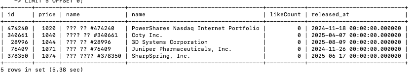
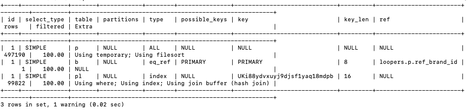
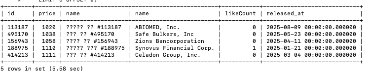
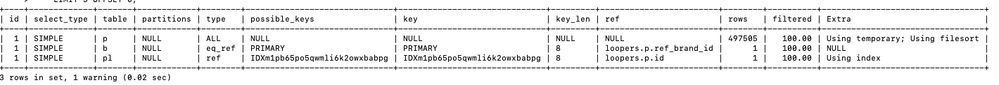

_# 상품 목록 비정규화 하기 전 쿼리 최적호ㅓ  ( product_like 좋아요 개수 서브쿼리로  )

## 인덱스 적용하기 전

- insert-all-data.sh  실행 -> generate-all-data.js 로  상품 데이터 50만개 생성
- k6 run product-list-sortby-price.js

```
  █ TOTAL RESULTS 

    checks_total.......................: 12      0.173676/s
    checks_succeeded...................: 100.00% 12 out of 12
    checks_failed......................: 0.00%   0 out of 12

    ✓ status is 200
    ✓ response body has 5 items

    HTTP
    http_req_duration.......................................................: avg=11.41s min=9.71s med=10.86s max=15.36s p(90)=13.39s p(95)=14.37s
      { expected_response:true }............................................: avg=11.41s min=9.71s med=10.86s max=15.36s p(90)=13.39s p(95)=14.37s
    http_req_failed.........................................................: 0.00%  0 out of 6
    http_reqs...............................................................: 6      0.086838/s

    EXECUTION
    iteration_duration......................................................: avg=11.51s min=9.82s med=10.97s max=15.47s p(90)=13.49s p(95)=14.48s
    iterations..............................................................: 6      0.086838/s
    vus.....................................................................: 1      min=1      max=1
    vus_max.................................................................: 1      min=1      max=1

    NETWORK
    data_received...........................................................: 6.3 kB 91 B/s
    data_sent...............................................................: 726 B  11 B/s
```

### 쿼리 실행 결과 





### 쿼리 실행 계획


```sql
SELECT
    p.id,
    p.price,
    p.name,
    b.name,
    (SELECT count(*) FROM product_like pl WHERE pl.ref_product_id = p.id) as likeCount,
    p.released_at
FROM
    product p
        LEFT JOIN
    brand b ON b.id = p.ref_brand_id
ORDER BY
    p.price ASC  
    LIMIT 5 OFFSET 0;
```




## 인덱스 적용 후 ( product 에 price 인덱스 추가 , product_like 에 ref_product_id 인덱스 추가 )

별 차이가 없고 오히려 더 느려진 것 같다.

```sql

  █ TOTAL RESULTS 

    checks_total.......................: 10      0.149851/s
    checks_succeeded...................: 100.00% 10 out of 10
    checks_failed......................: 0.00%   0 out of 10

    ✓ status is 200
    ✓ response body has 5 items

    HTTP
    http_req_duration.......................................................: avg=13.24s min=10.46s med=11.6s max=18.14s p(90)=17.04s p(95)=17.59s
      { expected_response:true }............................................: avg=13.24s min=10.46s med=11.6s max=18.14s p(90)=17.04s p(95)=17.59s
    http_req_failed.........................................................: 0.00%  0 out of 5
    http_reqs...............................................................: 5      0.074926/s

    EXECUTION
    iteration_duration......................................................: avg=13.34s min=10.56s med=11.7s max=18.26s p(90)=17.15s p(95)=17.7s 
    iterations..............................................................: 5      0.074926/s
    vus.....................................................................: 1      min=1                 max=1
    vus_max.................................................................: 1      min=1                 max=1

    NETWORK
    data_received...........................................................: 5.2 kB 78 B/s
    data_sent...............................................................: 605 B  9.066008695216432 B/s
```

### 쿼리 실행 결과




### 쿼리 실행 계확


